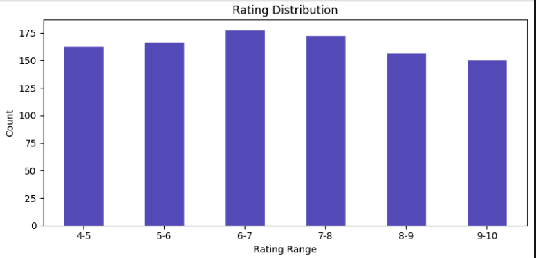
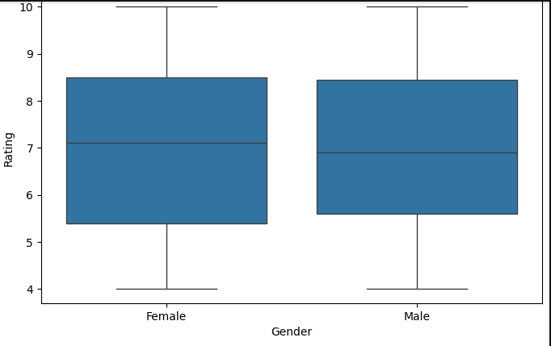
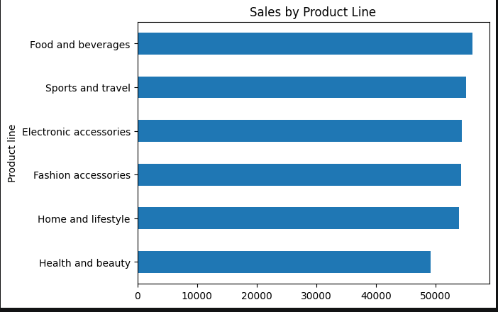

# SUPERMARKET-SALES
## PROJECT OVERVIEW
Supermarkets generate large volumes of transaction data every day, but struggle to understand what truly drives customer satisfaction.

## BUSINESS UNDERSTANDING
This dataset captures sales transactions from a supermarket chain with three branches located in Yangon, Naypyitaw, and Mandalay. Each row represents a transaction made by a customer.The business accepts three payment methods: cash, e-wallet, and credit card.

## OBJECTIVES
1. To analyze supermarket sales data and identify the factors that influence customer satisfaction ratings and purchasing patterns.
2. To develop and evaluate a Machine Learning model (Linear Regression) to predict customer satisfaction ratings based on selected sales features.

## VARIABLES

Invoice ID - A unique identifier assigned to each sales transaction.

 Branch - The branch where the transaction occurred. Three branches: A, B, and C.

 City - The city where each branch is located.

 Customer type - Whether the customer is a loyalty Member (with a membership card) or a Normal (walk-in) customer.

 Gender - The gender of the customer — Male or Female.
 
 Product line - The category of products purchased. Six lines: Health & Beauty, Electronic Accessories, Home & Lifestyle, Sports & Travel, Food & Beverages, Fashion Accessories.

 Unit price - The price per single unit of the product purchased, in USD.

 Quantity - Number of items purchased.

 Tax 5% - A 5% tax applied to the cost of goods sold (COGS).

 Total - The total amount paid by the customer, including tax

 Date - The date the transaction took place.

 Time - The time of day the transaction occurred

 Payment - The payment method used: Cash, E-wallet, or Credit card.

 COGS - Cost of goods sold -the direct cost to the supermarket for the goods sold.

 Gross margin % - The gross profit margin percentage. 

 Gross income - The actual profit earned from each transaction.

 Rating - A customer satisfaction rating on a scale of 1 to 10

 * The target variable is Rating, which represents the customer satisfaction score. It measures a customer's overall shopping experience at the supermarket and is what the model aims to predict.

## DATA CLEANING
checking missing values

Removed duplicate records

Prepared data for machine learning

## EXPLORATORY DATA ANALYSIS(EDA)
 ### 1. RATING DISTRIBUTON
 

 ### 2. GENDER VS RATING

 ### 3. SALES BY PRODUCT LINE
 

 ### Tools Used for Visualization
Matplotlib
Seaborn
Tableau

## FINAL INSIGHTS
- Ratings are evenly distributed across all ranges
- Health & Beauty has the lowest total sales
- Members are less satisfied than normal customers
- Credit card users gave the highest rating 

## MACHINE LEARNING
### MODEL USED
* Linear regression
A linear regression model was used because:
- Simple to understand and implement
- Fast training and prediction
- Works well for continuous value prediction

## RECOMMENDATIONS
- Improve Health & Beauty product line — lowest sales
- Strengthen the membership program — members rate lower than normal customers
- Maintain focus on Food & Beverages — highest sales and rating

## Presentation
view the project presentation here:
https://canva.link/y697dz6xl57da3q

## Dashboard
view the tableau dashboard here:
https://public.tableau.com/app/profile/twyla.cherop/viz/SUPERMARKETSALES_17827479716970/SUPERMARKETSALESDASHBOARD?publish=yes

## Live streamlit app

